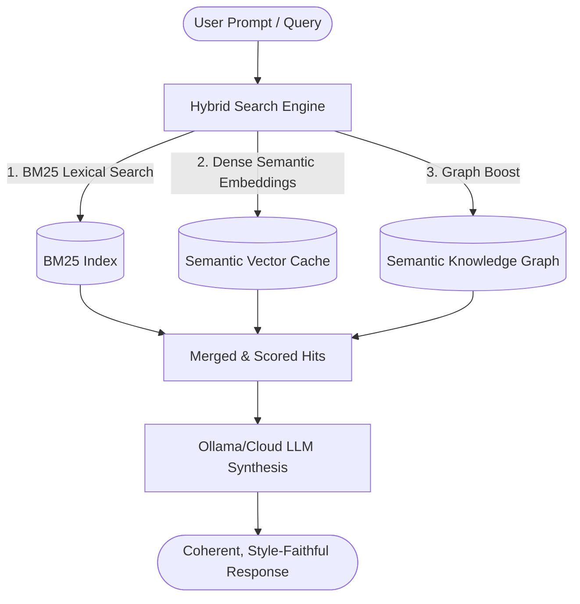
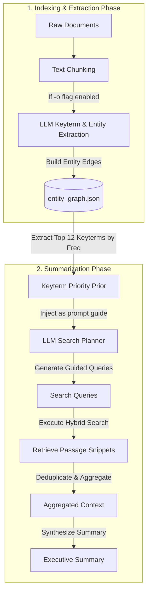
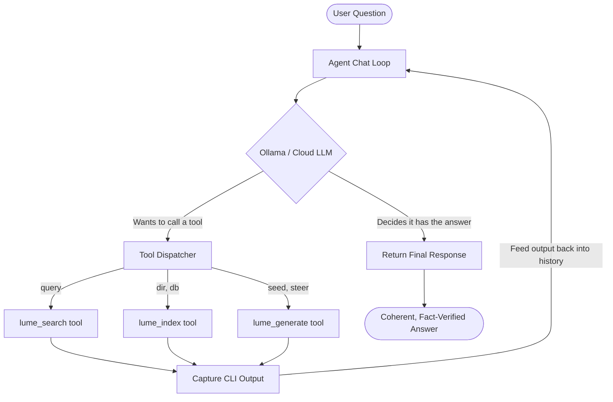

# 📖 Lume: Stylistic Synthesis & Retrieval-Augmented Generation Suite

Lume is a high-performance, FST-backed tagger, hybrid lexical/semantic search engine, and agentic document exploration suite. Written in Rust, it supports hybrid retrieval, semantic knowledge graph walks, autonomous agent loops, and document summarization.

---

## 📐 Architecture & Core Components

### 1. Hybrid Search Architecture
This diagram represents the static hybrid search compilation and LLM synthesis pipeline:



### 2. Keyterm Extraction & Graph-Guided Summarization Architecture
This diagram shows how keyterms are extracted during indexing and later used to guide query planning during document summarization:



### 3. Autonomous Agent Loop Architecture
This diagram represents the stateful tool-calling loop (`lume agent`) where the LLM plans and executes commands iteratively:



The system is organized into the following core Rust and Python modules:

*   **FST-Backed Phrase Tagger**: Performs longest-dominant-right matching using Lucene-style separator bytes. Built on [Tagger](file:///workspace/lume/src/lib.rs#L111) and [Entry](file:///workspace/lume/src/lib.rs#L43) in [src/lib.rs](file:///workspace/lume/src/lib.rs).
*   **Hybrid Search Engine**: Integrates BM25 lexical retrieval ([Bm25Index](file:///workspace/lume/src/bm25.rs)), spelling correction ([SpellIndex](file:///workspace/lume/src/spelling.rs)), and dense embeddings ([src/hybrid.rs](file:///workspace/lume/src/hybrid.rs)) with Semantic Knowledge Graph boost ([src/graph_search.rs](file:///workspace/lume/src/graph_search.rs)).
*   **Steered Markov Chain Synthesizer**: Under the hood, Lume uses a trigram [MarkovChain](file:///workspace/lume/src/semantic_mesh.rs#L129) to generate text. However, it goes beyond random walks by steering/biasing trigram transitions using FST tags, local attention feedback, and GTR-T5 semantic vector inversion ([src/inversion.rs](file:///workspace/lume/src/inversion.rs)).
*   **Agent & Summarization Engine**: Runs autonomous query planning, search exploration, and structured synthesis. Main entry points are [run_agent_loop](file:///workspace/lume/src/agent.rs#L703) and [summarize_document](file:///workspace/lume/src/agent.rs#L926) in [src/agent.rs](file:///workspace/lume/src/agent.rs).
*   **Model Context Protocol (MCP)**: Implements an MCP server over HTTP transport in [serve](file:///workspace/lume/src/agent.rs#L651) to expose indexing and search tools directly to AI agents.
*   **Python Document Extractor**: A high-efficiency parser ([lib/lume_extractor.py](file:///workspace/lume/lib/lume_extractor.py)) that handles PDF page text extraction and generates Q&A benchmark datasets using concurrent Ollama threads.

---

## 🚀 Installation & Quick Start

### Prerequisites
*   [Rust & Cargo](https://rustup.rs/) (v1.75+ recommended)
*   [Ollama](https://ollama.com/) running locally or accessible in your environment (defaults to using the cloud-backed model `gemma4:31b-cloud`).
*   [Python 3.10+](https://www.python.org/) with `requests` and `pypdf` installed (for PDF indexing/Q&A generation).

### Building the CLI
Build the release profile binary:
```bash
cargo build --release
```
The compiled binary will be located at `target/release/lume`.

---

## 🛠️ CLI Subcommands & Flags

Lume is controlled through a unified command-line interface defined in [src/main.rs](file:///workspace/lume/src/main.rs).

### 1. Indexing a Corpus
Index a directory containing plain text, markdown, or PDF files.
```bash
# Basic lexical index
./target/release/lume index docs/my_documents

# Semantic index with dense vectors (-s) and Ollama Entity Graph extraction (-o)
./target/release/lume index -s -o docs/my_documents
```
*   **Flags**:
    *   `-s, --semantic`: Enables dense vector search (requires a NUTS token).
    *   `-o, --ollama-entities`: Extract central entities and construct `entity_graph.json`.
    *   `-f, --force`: Forces re-indexing of all documents.
*   **Options**:
    *   `--db <PATH>`: Destination directory for the index metadata [default: `.lume-index`].
    *   `--ollama-model <MODEL>`: Ollama model for entity extraction [default: `gemma4:2b`].

---

### 2. Querying the Index
Search the persisted index using lexical (BM25) or hybrid search:
```bash
# Basic BM25 search
./target/release/lume search "Edmond Dantes"

# Hybrid search (weighting: 0.5 BM25, 0.5 vector semantic) with spelling correction (-c)
./target/release/lume search -c -a 0.5 "Edmond Dantes"
```
*   **Options**:
    *   `-a, --alpha <VAL>`: Hybrid weight. `0.0` is lexical-only; `1.0` is semantic-only [default: `0.5`].
    *   `-g, --graph <VAL>`: Entity graph boost weight [default: `0.4`].
    *   `-l, --limit <LIMIT>`: Maximum search hits [default: `10`].

---

### 3. Graph-Guided Summarization
Summarize an entire document using an agentic planning-and-retrieval loop guided by the highest-ranking nodes in the Semantic Knowledge Graph:
```bash
./target/release/lume summarize docs/my_documents/book.pdf
```
*   **How it works**:
    1. Reads `entity_graph.json` to identify the top 12 central concepts.
    2. Passes these concepts as priors to the Ollama model.
    3. Plans a series of distinct search queries targeting the key concepts.
    4. Executes queries, aggregates unique passages, and synthesizes a high-level executive summary.

---

### 4. Autonomous Agent Chat Loop
Spawn an autonomous agent to research and resolve a complex question by executing indexing and search tools iteratively:
```bash
./target/release/lume agent "Explain the relationship between Villefort and Mercedes"
```

---

### 5. Steered Markov Chain Generation
Generates style-faithful text based on the indexed corpus using a trigram Markov Chain whose transitions are guided by concept tags and vector inversion:
```bash
# Standard generation steered with specific tags
./target/release/lume generate "Dantes" --steer "revenge,castle"
```
*   **Tag-Steered Mode**: Biases transitions towards the `--steer` tags using co-occurrence weights from the index's posting lists.
*   **Vector-Steered Inversion Mode**: Automatically embeds the target seed, inverts it into its closest semantic tags, and runs multiple candidate generation rounds to find the closest cosine-similarity match to the target prompt.

---

### 6. Starting the MCP Server
Start the Model Context Protocol HTTP server to connect Lume to external AI agents:
```bash
./target/release/lume serve --port 8080
```

---

## 🐍 Python Extractor & Q&A Generator

Located at [lib/lume_extractor.py](file:///workspace/lume/lib/lume_extractor.py), this tool can extract text and generate Q&A evaluation datasets from document chunks:

```bash
# Extract text from a PDF
python lib/lume_extractor.py pdf my_doc.pdf

# Generate a Q&A evaluation benchmark using Ollama
python lib/lume_extractor.py qna my_doc.txt output_qna.json --model gemma4:31b-cloud
```
