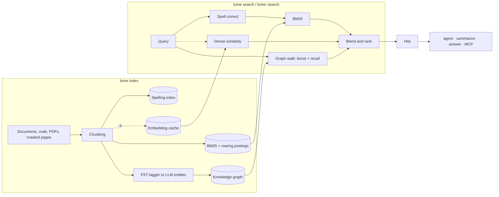

<div align="center">

# Lume

**Hybrid search, a semantic knowledge graph and agentic document memory, in one fast Rust binary.**

[](https://github.com/DeepBlueDynamics/lume/actions/workflows/ci.yml)
[](LICENSE)
[](https://www.rust-lang.org/)
[](#mcp-server)

[Quick start](#quick-start) · [Features](#features) · [CLI](#cli-reference) · [Lume TI](#lume-ti-telemetry-index) · [Performance](#performance) · [Development](#development)

</div>

---

Lume indexes your documents, code and crawled web pages and makes them searchable in milliseconds. It combines BM25 lexical retrieval, dense semantic embeddings and an index-native **Semantic Knowledge Graph** that boosts and expands results. The same engine powers an autonomous agent loop, a graph-guided summarizer, a style-faithful text generator, and an MCP server, so AI agents can use your corpus as memory.

The default build has **four runtime dependencies** (`tantivy-fst`, `ureq`, `serde`, `serde_json`). Everything else, including the in-development telemetry SQL engine, sits behind cargo features.

## Highlights

- **Hybrid retrieval:** BM25 (classic, plus and L variants), dense vectors and a graph boost, blended per query with one `--alpha` knob.
- **Index-native knowledge graph:** entity co-occurrence is computed from roaring-bitmap intersections ("counting the counts"). Edges are scored by statistical significance, so hub entities don't drown out real associations.
- **Deterministic or LLM entities:** build the graph from a local FST dictionary with no model at all, or extract entities with Ollama. The graph math is identical either way.
- **Agentic tools:** a planning and retrieval agent with structured failure recovery, a graph-guided document summarizer, and cited answers.
- **MCP server:** exposes indexing and search to any MCP-capable agent over HTTP.
- **Measured quality:** `lume eval` reports Hit@k, MRR and nDCG@k against Q&A files, without hand labels.
- **Lume TI (in development):** ask questions of a boat's Signal K telemetry, logbook and position in one SQL query, from an agent or over HTTP. [See below.](#lume-ti-telemetry-index)

## Quick start

**Requirements:** Rust stable. Optional: [Ollama](https://ollama.com/) for entity extraction, agents and summaries; a [Shivvr](#semantic-search) endpoint for dense embeddings; Python 3.10+ with `requests` and `pypdf` for PDF extraction.

```bash
git clone https://github.com/DeepBlueDynamics/lume.git
cd lume
cargo build --release          # binary at target/release/lume

# Index a folder of text, markdown, code or PDFs
./target/release/lume index docs/monte_cristo

# Search it
./target/release/lume search "Edmond Dantès prison escape"
```

The index is written to `.lume-index/` by default. Use `--db <dir>` to keep several indexes side by side.

## Features

### Hybrid search

`lume search` runs BM25 over the persisted index. When the index was built with `-s` and an embedding endpoint is reachable, it blends dense semantic similarity in as well. Spelling correction (`-c`) repairs misspelled query terms against the index vocabulary.

```bash
lume search "Edmond Dantes"                 # lexical BM25
lume search -c -a 0.5 "Edmund Dantez"       # hybrid with spell correction
lume search -a 0 -g 0 "run_agent_loop"      # pure lexical, no graph boost
```

### Semantic Knowledge Graph

During indexing, Lume tags entities in every section and builds a co-occurrence graph from pairwise roaring-bitmap intersections. At query time it resolves the entities in the query, walks one hop to their strongest neighbours, and:

- **boosts** passages that mention related entities (`-g`, default `0.4`);
- **recalls** strongly related passages that have no lexical hit at all.

Edges carry both Jaccard overlap and a **significance score**: a z-score of observed vs. expected co-occurrence (`|A||B|/N`), squashed to `[-1, 1]`. Choose with `--scoring relatedness` (default) or `--scoring jaccard`.

Entities come from either:
- a **local FST dictionary** (`--tag-dict dict.csv`), which is deterministic, offline and fast; or
- **LLM extraction** with Ollama (`-o`), using parallel workers set by `LUME_EXTRACT_WORKERS`.

### Semantic search

Dense embeddings come from a Shivvr endpoint (GTR-T5 space), set with `--shivvr-url` or `SHIVVR_BASE_URL` (default `http://localhost:8085`). Embeddings are cached per index, and search degrades gracefully to lexical when the endpoint is unavailable.

### Agents, summaries and answers

```bash
lume agent "Explain the relationship between Villefort and Mercedes"
lume summarize docs/my_documents/book.pdf
lume answer "Who betrayed Dantès, and why?"
```

- **`agent`** runs a tool-calling loop (search, index, generate) until it can answer. When its searches miss, a dedicated `lume_not_found` tool steers it to refine its queries instead of guessing.
- **`summarize`** takes the top 12 entities from the knowledge graph as priors, plans targeted searches, de-duplicates the passages and writes an executive summary.
- **`answer`** runs plan → retrieve → evaluate → refine, and returns a **cited** answer. It streams events for the visualizer.

### MCP server

```bash
lume serve                 # default port 5863 ("LUME" on a phone keypad)
lume serve --port 8080
```

This exposes `lume_index`, `lume_search`, `lume_generate` and `lume_not_found` as MCP tools over HTTP. Search runs in-process through the `lume::search` library API. Built with `--features ti`, `lume serve --ti-store <store>` adds the [Lume TI](#lume-ti-telemetry-index) tools.

### Text generation

`lume generate` synthesizes text in the corpus's style with a trigram Markov chain. It steers the chain toward concept tags (`--steer "revenge,castle"`) or, with an embedding endpoint, toward a target vector, using GTR-T5 inversion to hill-climb candidates.

### Crawling

`lume crawl <url>` saves a page as Markdown for indexing. It uses a local Grub crawler when `GRUB_BASE_URL` points at one; it authenticates to a remote one with `NUTS_SERVICES_TOKEN`; otherwise it falls back to a plain HTTP GET. Hacker News story URLs are assembled from the public API, story plus top-level comments.

### Retrieval evaluation

```bash
lume index --db .lume-eval-index --tag-dict dict/characters.csv docs/monte_cristo
lume eval  --db .lume-eval-index --compare docs/monte_cristo/qna.json
```

This reports **Hit@k, MRR and nDCG@k**. A section counts as relevant when it contains at least `--threshold` of the answer's content tokens, so no human labels or chunk alignment are needed. `--compare` runs both graph scoring modes and prints the difference. On *The Count of Monte Cristo* (1,926 sections, 373 questions), lexical BM25 reaches **Hit@10 ≈ 90 %** on single-fact questions.

### Visualizer

`lume stream <query>` emits the search's relaxation dynamics as NDJSON, and [`viz/`](viz/README.md) renders it as a live 3D field. `lume answer` streams into the same view, highlighting the passages the model was given and the ones it cited.

## Architecture


```mermaid
graph LR
    subgraph Index["lume index"]
        D[Documents, code, PDFs, crawled pages] --> C[Chunking]
        C --> B[(BM25 + roaring postings)]
        C --> S[(Spelling index)]
        C --> T[FST tagger or LLM entities] --> G[(Knowledge graph)]
        C -.->|-s| V[(Embedding cache)]
    end
    subgraph Query["lume search / lume::search"]
        Q[Query] --> SP[Spell correct] --> L[BM25]
        Q -.-> E[Dense similarity]
        Q --> W[Graph walk: boost + recall]
        L --> M[Blend and rank]
        E --> M
        W --> M
    end
    B --> L
    V --> E
    G --> W
    M --> R[Hits]
    R --> A[agent · summarize · answer · MCP]
```

## CLI reference

| Command | Purpose | Key options |
|---|---|---|
| `lume index <dir>` | Index text, markdown, code and PDFs | `--db`, `-s` semantic, `-o` LLM entities, `--tag-dict`, `-f` force, `--ollama-model` |
| `lume search <query>` | Lexical, hybrid or graph-boosted search | `--db`, `-l` limit (10), `-a` alpha (0.5), `-g` graph (0.4), `-c` spell check, `--scoring` |
| `lume eval <qna.json>` | Retrieval quality metrics | `--db`, `-k`, `-g`, `--scoring`, `-t`, `-n`, `--compare` |
| `lume agent <question>` | Autonomous tool-calling research loop | Ollama model and URL |
| `lume summarize <file>` | Graph-guided document summary | `--ollama-model` |
| `lume answer <question>` | Cited answer, streamed | `--model` |
| `lume generate <seed>` | Style-faithful generation | `--steer` |
| `lume crawl <url>` | Save a page as Markdown | `GRUB_BASE_URL`, `NUTS_SERVICES_TOKEN` |
| `lume serve` | MCP server over HTTP | `-p`/`--port` (5863), `--ti-store` (with `--features ti`) |
| `lume ti <cmd>` | Telemetry SQL: `query`, `explain`, `status`, `import-docs`, `verify` | `--store`, `--json`, `--width` (needs `--features ti`) |
| `lume stream <query>` | NDJSON search dynamics for `viz/` | |

Run `lume <command> --help` for the full option list.

## Lume TI: Telemetry Index

> **Status: in development** on the [`plan/lume-ti`](plan/README.md) branch, behind `--features ti`. The design, spec and progress are in [`plan/`](plan/README.md).

Lume TI turns a boat's [Signal K](https://signalk.org/) data stream into something you can **ask questions of**: in SQL, from an AI agent, or over HTTP. It runs on the boat's Raspberry Pi beside Signal K and OpenCPN, keeps working with no internet, and syncs sealed shards to a shore node that queries the whole fleet.

Where it's going:

- **One question across everything the boat knows.** Telemetry, the logbook, notes, alerts and position live in one column space, so "bilge pump cycling while motoring in more than 25 kn of wind near a leak note" is a single query, not five systems.
- **Agents that can read the boat.** MCP tools let a local agent find the right column from plain words (`ti_resolve`), run SQL (`ti_query`) and explain its answer, with no cloud round-trip.
- **Specs that watch themselves.** Index the engine manual or the battery datasheet next to the telemetry, extract the limits it states, and flag every stretch where the boat ran outside them.
- **A fleet view on shore.** Sealed, content-hashed shards sync from each vessel, so the shore node answers fleet-wide questions without re-ingesting raw data.
- **Full fidelity where it matters.** A second 1-second store keeps navigation, wind and depth at full rate for a configurable window (default 90 days), alongside the 10-second store kept for years.

### How it works

1. Live Signal K deltas and historical Parquet both feed one bucketer: 10-second columns per vessel, closed on a watermark, written through a crash-safe WAL, sealed into immutable shards with a BLAKE3 hash.
2. Every field is stored as **roaring bitmaps**: bit-sliced fixed-point numbers, single-valued states, presence, H3 geo cells, and document hits mapped onto the buckets they cover.
3. **Apache DataFusion** runs full SQL. Filters are pushed down into bitmap AND/OR/ANDNOT before a row is read, and aggregates are computed from the bitmaps where possible.

```sql
SELECT vessel, date_bin(INTERVAL '10 minutes', ts) AS win,
       max("environment.wind.speedTrue@max")
FROM telemetry
WHERE "propulsion.port.state" = 'started'
  AND "environment.wind.speedTrue@max" > 12.9          -- 25 kn
  AND within_nm(36.62, -122.39, 3.0)
  AND match(notes, 'leak OR water')
  AND ts > now() - INTERVAL '90 days'
GROUP BY vessel, win;
```

| | Lume TI | Columnar SQL (DuckDB, ClickHouse) | Time-series DB (InfluxDB) | Search engine (Lucene, Tantivy) |
|---|---|---|---|---|
| Multi-condition filters across many paths | bitmap ANDs per shard | column scans | weak across measurements | n/a |
| Full text joined with telemetry | `match()` is another bitmap | no index | no | text only |
| Geography | H3 cell bitmaps (`in_bbox`, `within_nm`) | functions over scans | limited | limited |
| "Runs where X held for N minutes" | `intervals()` straight from bitmap runs | window-function SQL | difficult | no |
| Full SQL for tools and agents | DataFusion, MCP, HTTP; Postgres wire planned | yes | partial | no |
| Runs beside the chartplotter on a Pi | designed for it | DuckDB yes | yes | yes |

*The table compares designs, not measurements. Broad queries can always fall back to an exact `raw` table over the same Parquet.*

### Try it

```bash
cargo build --release --features ti

# Backfill signalk-parquet history into a store (see plan/SETUP.md for test data)
cargo run --release -p ti-ingest --example backfill_store -- <data>/tier=raw <store>

lume ti query "SELECT vessel, count(*) FROM telemetry GROUP BY vessel" --store <store>
lume ti explain "<sql>" --store <store>       # shows which filters ran as bitmaps
lume ti status --store <store>
lume ti import-docs <docs_dir> --store <store>
lume ti verify --store <store> --corpus tests/golden
```

`lume serve --ti-store <store>` adds the `ti_query`, `ti_schema`, `ti_explain` and `ti_status` MCP tools and `/ti/*` HTTP endpoints (Arrow IPC or JSON) to the MCP server. **Don't run it on an untrusted network yet:** the server still listens on all interfaces, and loopback-by-default binding is being added now.

### Where it stands

| Area | State |
|---|---|
| Ingest: live WebSocket client, watermark bucketing, WAL, sealing, Parquet backfill | built |
| SQL: pushdown, bitmap aggregates, `intervals()`, `in_bbox` / `within_nm`, `match()` over notes, logbook and alerts | built |
| Correctness: 62-query golden corpus vs an independent DuckDB oracle over the raw Parquet | **58 pass, 0 fail**; 4 wait on open contract questions |
| CLI, MCP tools, HTTP `/ti` | built; `ti_resolve`, LAN-only binding and shore auth in progress |
| 1-second high-resolution store | ingest fan-out and retention built; SQL table in progress |
| Always-on service (`lume ti serve`), fleet sync, Postgres wire, Pi benchmarks | next |

### Benchmarks

Measured on an x86 Windows development host (release builds) and its Linux containers, over a generated fleet of 5 vessels × 90 days (95.9 M raw values, 11,500 Parquet files). **No Pi measurements yet.**

| Writes | Result | Target |
|---|---|---|
| Live ingest (decode → normalize → bucket → store) | **181,783 values/s**; 72 MB peak RSS in a container | Pi 5: ≥ 20,000 values/s, ≤ 400 MB |
| Parquet backfill, 95.9 M values | **389 s, 246,730 values/s** | |
| Index size | **554 MB, 0.29× the raw Parquet** (≈ 450 MB per vessel-year) | |
| Crash safety: 1,000 seeded `kill -9` runs | **0 lost, 0 duplicated** acknowledged records | 0 / 0 |
| Re-ingesting the full set into the same store | all 65 sealed shards byte-identical | identical |

| Queries | Result | Notes |
|---|---|---|
| Year-long "max wind per vessel per day" (5 vessel-years, 15.8 M buckets) | **40.3 ms vs 2.92 s (72×)** | bitmap aggregate vs DataFusion materializing the same rows; identical results |
| Bit-sliced range compare over a full 65,536-bucket shard | **41 µs** | |
| Open the full store and build the SQL catalog | 0.07 s + 1.8 s | |
| `count(*)` over the whole fleet store | 3.0 s | |

Not yet measured: Q1–Q8 p95 latency against DuckDB on the reference machine, on-device performance, and cold-cache behaviour.

## Performance

The core search engine, measured on real corpora:

- **Indexing:** a 2.8 MB novel chunks into about 1,900 sections and is searchable in **under a second** (lexical). Dense ingest of about 450 chunks through local Shivvr takes about 8 s.
- **Search:** two-stage roaring-bitmap pruning runs in about **10 µs**, and full lexical queries finish in under a millisecond. Hybrid queries add one embedding round-trip, and the graph boost is arithmetic on intersection counts the bitmaps already produced.
- **Vector inversion:** GTR-T5 vectors can be inverted back to text through Shivvr's `/invert` (about 0.88 self-similarity round-trip). The steered generator uses this to hill-climb toward a target.

## Development

```bash
cargo build                    # default build: 4 runtime dependencies
cargo test                     # 46 tests
cargo build --features ti      # include the Lume TI crates (DataFusion; slow cold build)
cargo test --features ti       # root tests including the TI CLI, MCP and HTTP surfaces
cargo test -p ti-sql           # any TI crate: ti-contracts, ti-core, ti-store, ti-ingest, ti-sql, ti-geo, ti-bench
```

TI crates are held to `cargo clippy -p <crate> --all-targets -- -D warnings` and `cargo fmt -p <crate> --check`. Contributor workflow, test data and conventions are in [`plan/SETUP.md`](plan/SETUP.md).

### Repository layout

| Path | Contents |
|---|---|
| `src/` | The `lume` library and CLI: BM25, FST tagger, knowledge graph, hybrid search, agents, MCP |
| `crates/ti-*` | Lume TI: contracts, bitmap core, store, ingest, SQL, geo, data generator |
| `lib/lume_extractor.py` | PDF text extraction and Q&A dataset generation |
| `viz/` | Live 3D visualizer for search dynamics |
| `tests/` | Golden search outputs and the TI SQL golden corpus |
| `plan/` | Lume TI spec, lanes, design notes and status |
| `docs/` | Sample corpora and blog posts |

### Python extractor

```bash
python lib/lume_extractor.py pdf my_doc.pdf
python lib/lume_extractor.py qna my_doc.txt output_qna.json --model gemma4:31b-cloud
```

## Roadmap

- Lume TI: the always-on boat service, `ti_resolve` and a local agent that answers questions about the boat, Postgres wire for Grafana and psql, fleet sync to shore, and Pi 5 benchmarks.
- Specs from documents: extract operating limits from manuals and datasheets in the document index and monitor telemetry against them.
- `lume sql`: the same DataFusion engine over any ordinary Lume index (`sections`, `entities`, `entity_edges`).
- On-the-fly fine-tuning of open embedding models, so the semantic space adapts to your corpus.

## License

[BSD 3-Clause](LICENSE). Copyright © 2026 DeepBlue Dynamics LLC, Kord Campbell and Steve Harris.

## Credits

Lume is built by [DeepBlue Dynamics](https://deepbluedynamics.com).

**[Steve Harris](https://github.com/jsclosures)** wrote the zero-dependency FST tagger at the heart of Lume, first in JavaScript and then ported to Rust as [rust-fstguardrails](https://github.com/jsclosures/rust-fstguardrails). His background in search consulting at Portaltown and Lucidworks, and as a U.S. Marine Corps air traffic controller, shows in the design: precise, safe and fast on bare metal. Lume started from his tagger.

**[Kord Campbell](https://github.com/kordless)** leads the project: the search engine, knowledge graph, agents and Lume TI built around that tagger.

The knowledge-graph approach owes a debt to [Trey Grainger](https://github.com/treygrainger)'s work on Solr's Semantic Knowledge Graph, to [Erik Hatcher](https://github.com/erikhatcher)'s explanation of it as "counting the counts", and to [Doug Turnbull](https://softwaredoug.com/)'s advocacy of hybrid relevance.
