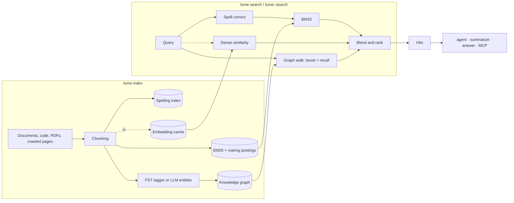

<div align="center">

# Lume

**Documents and time-series telemetry in one store, searchable and queryable together, in one fast Rust binary.**

An open source project from [DeepBlue Dynamics](https://deepbluedynamics.com), which builds open source agentic tooling for the marine electronics market.

[](https://github.com/DeepBlueDynamics/lume/actions/workflows/ci.yml)
[](LICENSE)
[](https://www.rust-lang.org/)
[](#mcp-server)

[Quick start](#quick-start) · [Lume TI: documents + time series](#lume-ti-telemetry-index) · [Features](#features) · [CLI](#cli-reference) · [Performance](#performance) · [Development](#development)

</div>

---

Lume keeps two kinds of data side by side and queries across both:

- **Documents.** It indexes documents, code and crawled web pages and makes them searchable in milliseconds, combining BM25, dense semantic embeddings and an index-native **Semantic Knowledge Graph**. The same engine powers an agent loop, a graph-guided summarizer, cited answers and an MCP server, so AI agents can use your corpus as memory.
- **Time series.** [**Lume TI**](#lume-ti-telemetry-index) is a bitmap-indexed SQL engine for sensor telemetry. It reads [Signal K](https://signalk.org/) out of the box, and its engine works on any *(entity, metric, time, value)* data. Numbers, states, positions and the notes, logbook and alerts that describe them share one store, so one query can ask *"what was the boat doing during every alarm this month?"*. It runs on the boat's Raspberry Pi with no internet connection.

The default build has **four runtime dependencies** (`tantivy-fst`, `ureq`, `serde`, `serde_json`). The time-series engine (DataFusion, Arrow, Parquet) sits behind `--features ti`.

## Highlights

- **Documents and time series in one SQL query (Lume TI):** 10-second and 1-second buckets stored as roaring bitmaps; filters, aggregates, geography (`within_nm`), "held for N minutes" (`intervals()`) and full-text `match()` push down into bitmap operations. Queried from SQL, a REPL, MCP tools, HTTP or pgwire. [See below.](#lume-ti-telemetry-index)
- **Hybrid retrieval:** BM25 (classic, plus and L variants), dense vectors and a graph boost, blended per query with one `--alpha` knob.
- **Index-native knowledge graph:** entity co-occurrence is computed from roaring-bitmap intersections ("counting the counts"). Edges are scored by statistical significance, so hub entities don't drown out real associations.
- **Deterministic or LLM entities:** build the graph from a local FST dictionary with no model at all, or extract entities with Ollama. The graph math is identical either way.
- **Agentic tools:** a planning and retrieval agent with structured failure recovery, a graph-guided document summarizer, and cited answers.
- **MCP server:** exposes indexing, search, and time-series query tools to any MCP-capable agent over HTTP.
- **OTLP telemetry receiver:** ingests OpenTelemetry metrics and logs directly from coding agents (Claude Code, Codex, Gemini) into dedicated `telemetry_agents` and `docs` tables.
- **Postgres wire & Grafana:** native read-only pgwire protocol (`--pg`) with SCRAM-SHA-256 for psql and Grafana, with prebuilt dashboards for agent telemetry.
- **Measured quality:** `lume eval` reports Hit@k, MRR and nDCG@k against Q&A files, without hand labels.

## Install

Prebuilt binaries (with Lume TI) for Linux x64/arm64, macOS Intel/Apple Silicon and Windows x64 are on [GitHub Releases](https://github.com/DeepBlueDynamics/lume/releases), each with `SHA256SUMS`.

```bash
# Linux / macOS: installs to ~/.local/bin (set LUME_INSTALL_DIR to change, LUME_VERSION to pin)
curl -fsSL https://github.com/DeepBlueDynamics/lume/releases/latest/download/install.sh | sh
```

```powershell
# Windows: installs to %LOCALAPPDATA%\Programs\lume and adds it to your user PATH
irm https://github.com/DeepBlueDynamics/lume/releases/latest/download/install.ps1 | iex
```

The Signal K plugin tarball (`signalk-lume-ti-<version>.tgz`, bundling the Linux arm64 and x64 binaries) is attached to the same release. Maintainers cut a release from **Actions → Bump version and release** (patch, minor, major or an explicit version). It updates `Cargo.toml`, `Cargo.lock` and the plugin's `package.json`, tags `vX.Y.Z`, and builds everything.

## Quick start

**Requirements:** Rust stable. Optional: [Ollama](https://ollama.com/) for entity extraction, agents and summaries; a [Shivvr](#semantic-search) endpoint for dense embeddings; Python 3.10+ with `requests` and `pypdf` for PDF extraction.

```bash
git clone https://github.com/DeepBlueDynamics/lume.git
cd lume
cargo build --release          # binary at target/release/lume

# Index a folder of text, markdown, code or PDFs
./target/release/lume index docs/monte_cristo

# Search it
./target/release/lume search "Edmond Dantès prison escape"
```

The index is written to `.lume-index/` by default. Use `--db <dir>` to keep several indexes side by side.

## Ollama setup

Ollama is optional. Lume uses it for LLM entity extraction (`lume index -o`), `lume agent` / `lume chat`, summaries, and the Signal K plugin's **Ask** tab. Search, the graph and Lume TI SQL all work without it. There are two ways to run it.

### Local Ollama (laptop or desktop)

1. Install Ollama from [ollama.com/download](https://ollama.com/download) and start it. It listens on `http://localhost:11434`, which is Lume's default.
2. Pull a model, for example `ollama pull qwen3:8b`.
3. Point Lume at it:

```bash
lume index docs/ -o --ollama-model qwen3:8b
lume chat --ti-store <store> --ollama-model qwen3:8b "What was the lowest battery voltage today?"
```

`--ollama-url` sets a different endpoint. Some commands also read `$OLLAMA_URL`.

### Cloud models via ollama.com (no local GPU)

Models with a `:cloud` tag, such as `glm-5.3:cloud`, run on Ollama's servers. Create an API key at [ollama.com](https://ollama.com/) and export it:

```bash
export OLLAMA_API_KEY=...        # read from the environment; never pass it as a flag
lume chat --ti-store <store> --ollama-url https://ollama.com --ollama-model glm-5.3:cloud "Summarise today's engine hours"
```

Lume sends `OLLAMA_API_KEY` **only** to `ollama.com` hosts. A local or LAN Ollama never receives it.

### Several endpoints with failover

`--ollama-url` takes a comma-separated list. Lume tries each in order and uses the first reachable one that has the model:

```bash
lume chat --ollama-url https://ollama.com,http://192.168.1.20:11434 --ollama-model glm-5.3:cloud ...
```

To share a laptop's Ollama with the boat's LAN, set `OLLAMA_HOST=0.0.0.0` on the laptop, restart Ollama, and allow TCP 11434 for the private network only. Ollama itself has no authentication.

### Ask tab on a Raspberry Pi (Signal K plugin)

The Ask tab defaults to `https://ollama.com` with `glm-5.3:cloud`, so the Pi doesn't need a local model. On the Pi 5, a local `qwen3:1.7b` produced 0.34 tokens/s. To install your key, run this from the repo on your machine:

```bash
scripts/pi-set-ollama-key.sh <ssh-host>      # e.g. pi@halos.local
```

It prompts for the key with hidden input and sends it to the Pi only over SSH stdin, so it never appears in argv, shell history or logs. On the Pi it:
- writes `ollama.key` (owner 1000:1000, mode 600);
- sets **Chat API Key File Path** in the plugin config;
- restarts Signal K.

`--check` shows the file's owner, mode and size, never its contents. To use a laptop's local models as a fallback, set **Chat Ollama API URLs** in the plugin config to, for example, `https://ollama.com,http://192.168.68.58:11434`. Manual steps are in [plan/SETUP.md §13](plan/SETUP.md).

## Features

### Hybrid search

`lume search` runs BM25 over the persisted index. When the index was built with `-s` and an embedding endpoint is reachable, it blends dense semantic similarity in as well. Spelling correction (`-c`) repairs misspelled query terms against the index vocabulary.

```bash
lume search "Edmond Dantes"                 # lexical BM25
lume search -c -a 0.5 "Edmund Dantez"       # hybrid with spell correction
lume search -a 0 -g 0 "run_agent_loop"      # pure lexical, no graph boost
```

### Semantic Knowledge Graph

During indexing, Lume tags entities in every section and builds a co-occurrence graph from pairwise roaring-bitmap intersections. At query time it resolves the entities in the query, walks one hop to their strongest neighbours, and:

- **boosts** passages that mention related entities (`-g`, default `0.4`);
- **recalls** strongly related passages that have no lexical hit at all.

Edges carry both Jaccard overlap and a **significance score**: a z-score of observed vs. expected co-occurrence (`|A||B|/N`), squashed to `[-1, 1]`. Choose with `--scoring relatedness` (default) or `--scoring jaccard`.

Entities come from either:
- a **local FST dictionary** (`--tag-dict dict.csv`), which is deterministic, offline and fast; or
- **LLM extraction** with Ollama (`-o`), using parallel workers set by `LUME_EXTRACT_WORKERS`.

### Semantic search

Dense embeddings come from a Shivvr endpoint (GTR-T5 space), set with `--shivvr-url` or `SHIVVR_BASE_URL` (default `http://localhost:8085`). Embeddings are cached per index, and search degrades gracefully to lexical when the endpoint is unavailable.

### Agents, summaries and answers

```bash
lume agent "Explain the relationship between Villefort and Mercedes"
lume summarize docs/my_documents/book.pdf
lume answer "Who betrayed Dantès, and why?"
```

- **`agent`** runs a tool-calling loop (search, index, generate) until it can answer. When its searches miss, a dedicated `lume_not_found` tool steers it to refine its queries instead of guessing.
- **`summarize`** takes the top 12 entities from the knowledge graph as priors, plans targeted searches, de-duplicates the passages and writes an executive summary.
- **`answer`** runs plan → retrieve → evaluate → refine, and returns a **cited** answer. It streams events for the visualizer.

### MCP server

```bash
lume serve --bind 127.0.0.1 # local, default port 5863 ("LUME" on a phone keypad)
lume serve --bind 127.0.0.1 --port 8080
```

This exposes `lume_index`, `lume_search`, `lume_generate` and `lume_not_found` as MCP tools over HTTP. Search runs in-process through the `lume::search` library API. Built with `--features ti`, `lume serve --ti-store <store>` adds the [Lume TI](#lume-ti-telemetry-index) tools, OTLP ingestion (`--otlp`), and PostgreSQL wire access (`--pg`).

Plain `lume serve` retains its `0.0.0.0` default bind, but now refuses to start off loopback without `--nuts-auth` or `--http-token-file`. For local access use `lume serve --bind 127.0.0.1`. TI serving still defaults to loopback.

Use `--nuts-auth --nuts-allow sailor@example.com,user-17` on plain/TI `serve` or `ti ingest --serve`. The optional auth URL defaults to `https://auth.nuts.services`; an allowlist may also be supplied as `--nuts-allow @/path/to/allowlist`. Send a nuts RS256 JWT or an `ahp_` token in `Authorization: Bearer <token>`. JWTs verify offline using startup/12-hour JWKS refresh and a public-key cache at `<store>/auth/jwks.json` (plain serve: `.lume-index/auth/jwks.json`); AHP tokens exchange online and cache their verified JWT in memory until expiry. Allowlist membership is mandatory. Read scope covers TI/MCP/SSE; write covers OTLP and indexing (MCP indexing needs both). GET `/health` is public when nuts auth is on. No key cache plus no network refuses startup.

`--http-token-file /path/to/token` remains a full-access static alternative, checked in constant time. It may coexist with nuts auth. Configured sync/OTLP tokens override global auth on their own routes. Missing, wrong or unauthorized credentials return empty-body 401. Never put credentials in a URL; use HTTPS through a trusted reverse proxy for remote access. Loopback without either flag retains local access. See [D51](plan/decisions/D51-http-auth.md) for the policy and bounds.

The OTLP bearer protects ingestion routes only on a shared server; it does not authenticate TI or MCP. Standalone `lume ti otlp` exposes only its two ingestion endpoints.

### Text generation

`lume generate` synthesizes text in the corpus's style with a trigram Markov chain. It steers the chain toward concept tags (`--steer "revenge,castle"`) or, with an embedding endpoint, toward a target vector, using GTR-T5 inversion to hill-climb candidates.

### Crawling

`lume crawl <url>` saves a page as Markdown for indexing. It uses a local Grub crawler when `GRUB_BASE_URL` points at one; it authenticates to a remote one with `NUTS_SERVICES_TOKEN`; otherwise it falls back to a plain HTTP GET. Hacker News story URLs are assembled from the public API, story plus top-level comments.

### Retrieval evaluation

```bash
lume index --db .lume-eval-index --tag-dict dict/characters.csv docs/monte_cristo
lume eval  --db .lume-eval-index --compare docs/monte_cristo/qna.json
```

This reports **Hit@k, MRR and nDCG@k**. A section counts as relevant when it contains at least `--threshold` of the answer's content tokens, so no human labels or chunk alignment are needed. `--compare` runs both graph scoring modes and prints the difference. On *The Count of Monte Cristo* (1,926 sections, 373 questions), lexical BM25 reaches **Hit@10 ≈ 90 %** on single-fact questions.

### Visualizer

`lume stream <query>` emits the search's relaxation dynamics as NDJSON, and [`viz/`](viz/README.md) renders it as a live 3D field. `lume answer` streams into the same view, highlighting the passages the model was given and the ones it cited.

## Architecture


```mermaid
graph LR
    subgraph Index["lume index"]
        D[Documents, code, PDFs, crawled pages] --> C[Chunking]
        C --> B[(BM25 + roaring postings)]
        C --> S[(Spelling index)]
        C --> T[FST tagger or LLM entities] --> G[(Knowledge graph)]
        C -.->|-s| V[(Embedding cache)]
    end
    subgraph Query["lume search / lume::search"]
        Q[Query] --> SP[Spell correct] --> L[BM25]
        Q -.-> E[Dense similarity]
        Q --> W[Graph walk: boost + recall]
        L --> M[Blend and rank]
        E --> M
        W --> M
    end
    B --> L
    V --> E
    G --> W
    M --> R[Hits]
    R --> A[agent · summarize · answer · MCP]
```

## CLI reference

| Command | Purpose | Key options |
|---|---|---|
| `lume index <dir>` | Index text, markdown, code and PDFs | `--db`, `-s` semantic, `-o` LLM entities, `--tag-dict`, `-f` force, `--ollama-model` |
| `lume search <query>` | Lexical, hybrid or graph-boosted search | `--db`, `-l` limit (10), `-a` alpha (0.5), `-g` graph (0.4), `-c` spell check, `--scoring` |
| `lume eval <qna.json>` | Retrieval quality metrics | `--db`, `-k`, `-g`, `--scoring`, `-t`, `-n`, `--compare` |
| `lume agent <question>` | Autonomous tool-calling research loop | Ollama model and URL |
| `lume summarize <file>` | Graph-guided document summary | `--ollama-model` |
| `lume answer <question>` | Cited answer, streamed | `--model` |
| `lume generate <seed>` | Style-faithful generation | `--steer` |
| `lume crawl <url>` | Save a page as Markdown | `GRUB_BASE_URL`, `NUTS_SERVICES_TOKEN` |
| `lume serve` | MCP, TI HTTP, OTLP and pgwire server | `-p`/`--port` (5863), `--ti-store`, `--http-token-file`, `--otlp`, `--otlp-token-file`, `--pg`, `--pg-bind` |
| `lume ti otlp` | Standalone OTLP metrics & logs receiver | `--store`, `--bind` (127.0.0.1), `--port` (4318), `--otlp-token-file` |
| `lume ti <cmd>` | Telemetry SQL: `repl`, `query`, `explain`, `status`, `import-docs`, `ingest`, `otlp`, `verify` | `--store`, `--json`, `--width` (needs `--features ti`) |
| `lume stream <query>` | NDJSON search dynamics for `viz/` | |

Run `lume <command> --help` for the full option list.

## Lume TI: Telemetry Index

Lume TI keeps **documents and time series in one store** and lets one SQL query reach across both. A boat's sensor data, its logbook, notes and alerts, and its position all live in the same column space, so *"what was the boat doing during every alarm this month?"* or *"when did we see shallow water at anchor within a minute of a leak note?"* are single queries.

It reads **[Signal K](https://signalk.org/) out of the box**, live from the server's WebSocket stream and historically from `signalk-parquet` files, and it runs on the boat's Raspberry Pi beside Signal K and OpenCPN with no internet connection. The engine itself is generic: anything that becomes *(entity, metric, time, value)* (sensor fleets, robots, industrial historians) fits the same store. A column-mapped reader for arbitrary time-series Parquet is the next input after Signal K.

Build it with `cargo build --release --features ti`. The design and spec are in [`plan/`](plan/README.md).

### One store, two kinds of data

```sql
-- Documents to time series: every alarm, with what the boat was doing while it was active.
SELECT d.title, d.ts_start, d.score,
       max(t."navigation.speedOverGround@max")        AS max_sog_ms,
       max(t."environment.wind.speedTrue@max")        AS max_wind_ms,
       min(t."electrical.batteries.house.voltage@min") AS min_volts
FROM docs d
JOIN telemetry t ON t.vessel = d.vessel AND t.ts >= d.ts_start AND t.ts < d.ts_end
WHERE match(d.body, 'alarm')
GROUP BY d.title, d.ts_start, d.score
ORDER BY d.ts_start;

-- Time series filtered by documents: depth, speed and state whenever a note mentions a leak.
SELECT ts, "environment.depth.belowTransducer@min" AS depth_m,
       "navigation.speedOverGround@max" AS sog_ms, "navigation.state"
FROM telemetry
WHERE match(notes, 'leak OR water')
  AND within_nm(36.62, -122.39, 3.0)
  AND ts > now() - INTERVAL '30 days';
```

- **`telemetry`**: one row per vessel and 10-second bucket. Each Signal K path becomes columns such as `path@min`, `path@max`, `path@mean` and `path@last`, plus single-valued state columns (`navigation.state`, `propulsion.port.state`). A second store keeps navigation, wind and depth at **1-second** resolution as `telemetry_hr`, with its own retention (default 90 days).
- **`telemetry_lume`**: Lume's own operational self-telemetry in `<store>/stores/lume` (entity `lume.urn:host:<hostname>`). It tracks ingest rates (`lume.ingest.valuesPerSecond@mean`), process RSS (`lume.process.rssBytes@max`), lag, and flush cost on its own independent bucketer, keeping vessel data isolated.
- **`telemetry_agents`**: Agent metrics received via OTLP (`POST /v1/metrics`) in `<store>/stores/agents`. Monotonic sums (token counts) compute running totals per entity and dimensional attribute (`claude_code.token.usage.input.model.<model>@last`), with counter state persisted across restarts. Gauges and non-monotonic sums populate `@mean` profiles.
- **`docs`**: notes, logbook entries, alerts, and agent event logs (`kind = 'logbook'`). Each covers its time range `[ts_start, ts_end)`, and `score` is the Lume BM25 score when the query uses `match()`.
- **`match(notes|logbook|alerts, 'q')`** filters telemetry buckets by the documents that cover them. `match(body, 'q')` filters the `docs` table itself. Both are lexical Lume BM25 and run locally.
- **`within_nm(lat, lon, nm)`** and **`in_bbox(...)`** use H3 cell bitmaps. **`intervals()`** returns runs where a condition held for at least N minutes.
- **`vessels`**, **`paths`** and **`shards`** are catalog tables, and **`raw`** is an exact view over the source Parquet.

### How it works

1. Live Signal K deltas and historical Parquet feed one bucketer, which closes buckets on a watermark. Records go through a crash-safe write-ahead log into open shards, and shards are sealed into immutable files with a BLAKE3 content hash.
2. Every field is stored as **roaring bitmaps**: bit-sliced fixed-point numbers, single-valued states, presence, H3 geo cells, and document hits mapped onto the buckets they cover.
3. **Apache DataFusion** runs full SQL. Filters are pushed down into bitmap AND/OR/ANDNOT before a row is read, and aggregates are computed from the bitmaps where possible.

| | Lume TI | Columnar SQL (DuckDB, ClickHouse) | Time-series DB (InfluxDB) | Search engine (Lucene, Tantivy) |
|---|---|---|---|---|
| Multi-condition filters across many paths | bitmap ANDs per shard | column scans | weak across measurements | n/a |
| Documents joined with telemetry | `match()` is another bitmap; `docs` is a table | no text index | no | text only |
| Geography | H3 cell bitmaps (`in_bbox`, `within_nm`) | functions over scans | limited | limited |
| "Runs where X held for N minutes" | `intervals()` straight from bitmap runs | window-function SQL | difficult | no |
| Interfaces | SQL, REPL, MCP tools, HTTP (Arrow IPC / JSON), pgwire | SQL | InfluxQL / Flux | query DSL |
| Runs beside the chartplotter on a Pi | designed for it | DuckDB yes | yes | yes |

### Use it

```bash
cargo build --release --features ti

# Backfill signalk-parquet history (telemetry plus notes/logbook/alerts) into a store
cargo run --release -p ti-ingest --example backfill_store -- <data>/tier=raw <store>

lume ti repl --store <store>                      # interactive SQL: .help, .examples, .schema, .explain
lume ti query "SELECT vessel, count(*) FROM telemetry GROUP BY vessel" --store <store> [--json]
lume ti query "SELECT vessel, max(\"lume.ingest.valuesPerSecond@mean\") AS vps FROM telemetry_lume GROUP BY vessel" --store <store>
lume ti explain "<sql>" --store <store>           # which filters ran as bitmaps
lume ti status --store <store>
lume ti import-docs <docs_dir> --store <store>
lume ti verify --store <store> --corpus tests/golden

# Standalone OTLP-only receiver (POST /v1/metrics and /v1/logs; all other routes return 404)
lume ti otlp --store <store> [--bind 127.0.0.1] [--port 4318] [--otlp-token-file <path>]

# MCP tools, /ti HTTP endpoints, OTLP receiver and PostgreSQL wire access
lume serve --ti-store <store> [--bind <IP>] [--otlp] [--pg 5864]

# Stream live Signal K deltas into the store with supervised HTTP, OTLP and pgwire
lume ti ingest --signalk ws://127.0.0.1:3000 --store <store> --serve --otlp --pg 5864
```

`lume serve --ti-store` adds five MCP tools for agents:
- `ti_resolve`: plain words → the right column;
- `ti_query`, `ti_schema`, `ti_explain`, `ti_status`.

It also adds HTTP endpoints:
- `POST /ti/query`, answering in Arrow IPC or, with `Accept: application/json`, JSON;
- `GET /ti/schema`, `POST /ti/explain`, `GET /ti/status`, `GET /ti/resolve?q=`;
- With `--otlp`: `POST /v1/metrics` and `POST /v1/logs` (HTTP/JSON).

With `--pg <port>`, it exposes read-only PostgreSQL protocol access (pgwire) for psql and Grafana, with SCRAM authentication configured via `--pg-auth-config <path>` and optional TLS. Results on HTTP are capped at 500 rows and 64 KiB, with a hint to aggregate or narrow the time range. The server listens on `127.0.0.1` and sends no wildcard CORS headers; a non-loopback `--bind` requires `--nuts-auth` or `--http-token-file`.

### Agent telemetry & Grafana dashboards

Lume TI includes an OpenTelemetry Protocol (OTLP) HTTP/JSON receiver (`POST /v1/metrics`, `POST /v1/logs`, D50) to ingest telemetry from coding agents (Claude Code, Codex CLI, Gemini CLI). Standalone `lume ti otlp` exposes only these two POST endpoints; `/ti`, MCP, SSE and all other routes return 404. A non-loopback standalone listener requires `--otlp-token-file`. Query its store using a separate loopback TI server or the local CLI:

- **Metrics** populate `telemetry_agents` in `<store>/stores/agents`. Monotonic sums (token counts) compute running totals per entity and dimensional attribute path (`claude_code.token.usage.input.model.<model>@last`), with counter totals persisted across restarts (`otlp-counters.json`). Non-monotonic sums and gauges map to numeric aggregates (`@mean`, `@last`).
- **Logs** populate `docs` with `kind = 'logbook'`, event names in `title`, and structured attributes in `body`, searchable via `match(body, '...')`.
- **Grafana dashboard**: `bench/grafana/lume-agents-dashboard.json` connects to the `lume-ti` datasource (pgwire), visualizing:
  - Tokens over time by agent using D50 dimensional paths (`claude_code.token.usage@last`).
  - Active time in seconds from `claude_code.active_time`.
  - Active 10-second buckets per agent entity (`vessel AS entity`, `count(DISTINCT ts)`).
  - Recent logbook documents table from `docs` with interactive text-search filtering via `${q:sqlstring}`.

See [`bench/grafana/README.md`](bench/grafana/README.md) for import and provisioning steps.

### Raspberry Pi deployment & Signal K plugin

- **Signal K plugin (`plugins/signalk-lume-ti`)**: embeds Lume TI into Signal K.
  - The **Ask** tab defaults to calling `https://ollama.com` directly (`glm-5.3:cloud`) via `chatApiKeyFile` (passing `OLLAMA_API_KEY` in the child environment only; no local model container needed, freeing ~4.2 GB disk).
  - Supervised ingestion manages the `lume` child process and exposes an `otlpEnabled` receiver setting, pinning query endpoints to loopback `127.0.0.1` to prevent unauthenticated network access.
- **Deployment scripts**:
  - `scripts/provision-pi.sh <ssh-host> [--dry-run] [--lume-bin <path>] [--debs <dir>] [--with-ollama]`: idempotent host provisioner configuring memory cgroups (`cgroup_enable=memory cgroup_memory=1` in `cmdline.txt`), pinning self vessel UUID, installing HaLOS `.deb` packages, and deploying the plugin.
  - `scripts/deploy-pi.sh <ssh-host> [--dry-run] [--lume-bin <path>]`: stages the plugin and arm64 `lume` binary (mode 755) to `/var/lib/container-apps/.../signalk-lume-ti` and restarts the service.
  - `scripts/pi-retire-ollama.sh <ssh-host> [--dry-run]`: stops and disables `marine-ollama-container` and removes the 4.2 GB Docker image while keeping persistent models and data.
  - All scripts support `LUME_DEPLOY_SSH_CONFIG` to isolate SSH configurations without modifying `~/.ssh/config`.
- **HaLOS container packages (`deploy/halos/`)**: Debian packages for Grub Crawler (`marine-grubcrawler-container`) and Ollama gateway (`marine-ollama-container`) feature dynamic RAM auto-sizing via `app-prestart.sh` (`MEMORY_LIMIT=auto`).

### Measured

Every number below comes from a test or command in this repository, run on an x86 Windows development host with release builds. The dataset is the deterministic generated fleet from `ti-bench gen`: 5 vessels × 90 days around Monterey Bay, 95.9 M values in 11,500 `signalk-parquet` files, plus 1,610 notes, logbook entries and alerts. Being deterministic means every answer can be checked exactly against an independent DuckDB run over the same files. Numbers cite [`plan/bench/benchmark-report.md`](plan/bench/benchmark-report.md).

**Correctness**

| Check | Result | Source |
|---|---|---|
| Golden SQL corpus vs an independent DuckDB oracle over the raw Parquet: telemetry, text, geo, `intervals()`, joins | **58 of 58 runnable queries match** (4 more wait on contract questions) | `lume ti verify --corpus tests/golden` |
| 24-hour stream replay vs an independent oracle | **153,374 / 153,374** bucket records match | `crates/ti-ingest/tests/m2_gate.rs` |
| Re-ingesting the full 95.9 M-value set into the same store | all 65 sealed shards **byte-identical** | `m2_gate.rs`, `test_m2_parquet_backfill_idempotence` |
| Crash safety: 1,000 seeded `kill -9` runs during ingest | **0 lost, 0 duplicated** acknowledged records | `crates/ti-store/tests/crash_recovery.rs` |
| Same input, same shard bytes and hash, for every field type | identical | `crates/ti-store/tests/seal_determinism.rs` |
| Plain words → column (`ti_resolve`), 100 phrases over 488 columns | right column in the top 3 for **93 / 100** | `tests/ti_resolve.rs` |

**Speed and size**

| Measurement | Result | Source |
|---|---|---|
| Year-long "max wind per vessel per day" (5 vessel-years, 15.8 M buckets) | **40.3 ms**, vs 2.92 s for DataFusion materializing the same rows: **72× faster**, identical results | `crates/ti-sql/tests/m4.rs`, `synthetic_year_benchmark` |
| Bit-sliced range compare over a full 65,536-bucket shard | **41 µs** | `crates/ti-core/examples/compare_baseline.rs` |
| Live ingest pipeline (decode → normalize → bucket → store) | **181,783 values/s**; 72 MB peak RSS on Linux | `m2_gate.rs`, `test_m2_throughput_and_rss` |
| Parquet backfill of 95.9 M values | **389 s, 246,730 values/s** | `crates/ti-ingest/examples/backfill_store.rs` |
| Index size | **554 MB, 0.29× the raw Parquet** (about 450 MB per vessel-year) | `backfill_store` |
| Open the store and answer `lume ti status` | **2.2 s** cold | `lume ti status` |
| `count(*)` over the whole fleet store | 3.0 s | `crates/ti-sql/examples/open_timing.rs` |

### Next

- **Any time-series Parquet:** a column-mapped reader (`--entity`, `--time`, long or wide format) next to the Signal K one.
- **Fleet sync:** resumable, hash-verified shard shipping from boat to shore, and a shore node that queries the whole fleet.
- **On-device numbers:** Pi 5 ingest and query benchmarks, and Q1–Q8 p95 against DuckDB on the reference machine.

## Performance

The core search engine, measured on real corpora:

- **Indexing:** a 2.8 MB novel chunks into about 1,900 sections and is searchable in **under a second** (lexical). Dense ingest of about 450 chunks through local Shivvr takes about 8 s.
- **Search:** two-stage roaring-bitmap pruning runs in about **10 µs**, and full lexical queries finish in under a millisecond. Hybrid queries add one embedding round-trip, and the graph boost is arithmetic on intersection counts the bitmaps already produced.
- **Vector inversion:** GTR-T5 vectors can be inverted back to text through Shivvr's `/invert` (about 0.88 self-similarity round-trip). The steered generator uses this to hill-climb toward a target.

## Development

```bash
cargo build                    # default build: 4 runtime dependencies
cargo test                     # 46 tests
cargo build --features ti      # include the Lume TI crates (DataFusion; slow cold build)
cargo test --features ti       # root tests including the TI CLI, MCP and HTTP surfaces
cargo test -p ti-sql           # any TI crate: ti-contracts, ti-core, ti-store, ti-ingest, ti-sql, ti-geo, ti-bench
```

TI crates are held to `cargo clippy -p <crate> --all-targets -- -D warnings` and `cargo fmt -p <crate> --check`. Contributor workflow, test data and conventions are in [`plan/SETUP.md`](plan/SETUP.md).

### Repository layout

| Path | Contents |
|---|---|
| `src/` | The `lume` library and CLI: BM25, FST tagger, knowledge graph, hybrid search, agents, MCP |
| `crates/ti-*` | Lume TI: contracts, bitmap core, store, ingest, SQL, geo, data generator |
| `lib/lume_extractor.py` | PDF text extraction and Q&A dataset generation |
| `viz/` | Live 3D visualizer for search dynamics |
| `tests/` | Golden search outputs and the TI SQL golden corpus |
| `plan/` | Lume TI spec, lanes, design notes and status |
| `docs/` | Sample corpora and blog posts |

### Python extractor

```bash
python lib/lume_extractor.py pdf my_doc.pdf
python lib/lume_extractor.py qna my_doc.txt output_qna.json --model gemma4:31b-cloud
```

## Roadmap

- Lume TI: a column-mapped reader for any time-series Parquet, fleet sync to shore, and Pi 5 benchmarks.
- Specs from documents: extract operating limits from manuals and datasheets in the document index and monitor telemetry against them.
- `lume sql`: the same DataFusion engine over any ordinary Lume index (`sections`, `entities`, `entity_edges`).
- On-the-fly fine-tuning of open embedding models, so the semantic space adapts to your corpus.

## License

[BSD 3-Clause](LICENSE). Copyright © 2026 DeepBlue Dynamics LLC, Kord Campbell and Steve Harris.

## Credits

Lume is built by [DeepBlue Dynamics](https://deepbluedynamics.com), which builds open source agentic tooling for the marine electronics market: software that lets agents and people ask questions of a boat's instruments, logs and documents, on board and without a connection.

**[Steve Harris](https://github.com/jsclosures)** wrote the zero-dependency FST tagger at the heart of Lume, first in JavaScript and then ported to Rust as [rust-fstguardrails](https://github.com/jsclosures/rust-fstguardrails). His background in search consulting at Portaltown and Lucidworks, and as a U.S. Marine Corps air traffic controller, shows in the design: precise, safe and fast on bare metal. Lume started from his tagger.

**[Kord Campbell](https://github.com/kordless)** leads the project: the search engine, knowledge graph, agents and Lume TI built around that tagger.

The knowledge-graph approach owes a debt to [Trey Grainger](https://github.com/treygrainger)'s work on Solr's Semantic Knowledge Graph, to [Erik Hatcher](https://github.com/erikhatcher)'s explanation of it as "counting the counts", and to [Doug Turnbull](https://softwaredoug.com/)'s advocacy of hybrid relevance.
